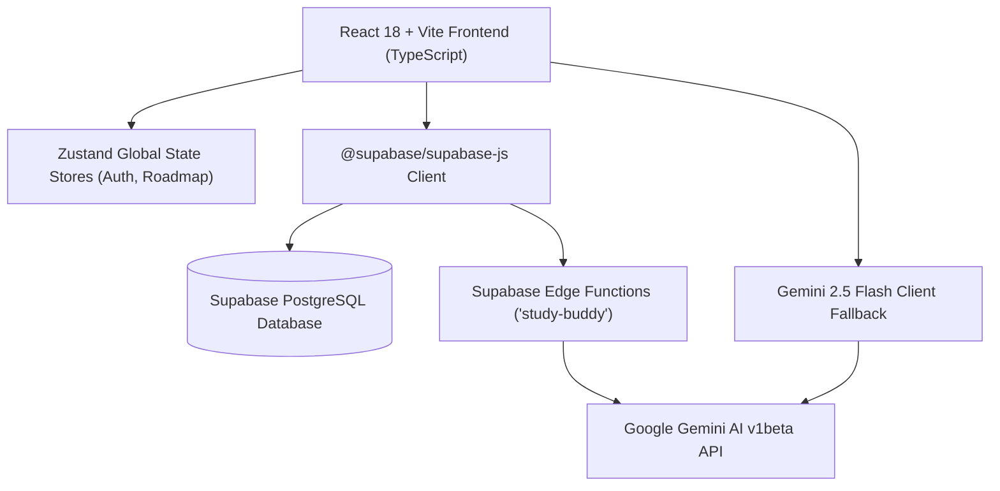

# 🚀 Skillora AI: Complete Project Audit & Handover Document

> **Author / Lead:** Muhammad Haris Khalil  
> **Project Name:** Skillora AI (AI-Powered Personalized Learning & Career Upskilling Platform)  
> **Repository:** `d:\Skillora AI`  
> **Version:** `1.0.0` (Production Ready Candidate)  
> **Audit Date:** September 2026  

---

## 📌 Executive Summary

**Skillora AI** is an intelligent, full-stack educational and career acceleration web application designed to guide students, developers, and career changers through personalized tech roadmaps, interactive lessons, AI tutoring, skill gap analysis, and verified portfolio capstones.

This document serves as an exhaustive audit of:
1. **All Completed & Fully Functional Features**
2. **Architecture & Technology Stack**
3. **Database Schema & Migrations Status**
4. **Remaining / Backlog Tasks for Next Development Phase (Handover for Claude / Next AI)**
5. **Environment Setup & Operational Runbook**

---

## 🛠️ Architecture & Tech Stack



### Core Technologies:
* **Frontend Framework:** React 18 with Vite 5, TypeScript 5.2, TailwindCSS 3.4
* **Icons & UI Elements:** `@heroicons/react` v24, custom Glassmorphism & Cyberpunk-Dark theme
* **State Management:** Zustand 4.5 (`useAuthStore`, roadmap state, profile caching)
* **Backend / Database:** Supabase (PostgreSQL 15, Row-Level Security, Auth, Edge Functions)
* **AI Engine:** Google Gemini AI (`gemini-2.5-flash`, `gemini-1.5-flash`, interactions API)
* **Routing:** React Router DOM v6.22

---

## 📂 Project Structure Map

```
Skillora AI/
├── .env.local                               # Environment Secrets (Supabase, Gemini)
├── index.html                               # Root HTML template
├── package.json                             # Dependencies & Scripts
├── tailwind.config.js                       # Tailwind Theme Tokens & Utilities
├── tsconfig.json                            # TypeScript Compiler Options
├── vite.config.ts                           # Vite Configuration & Aliases
├── supabase/
│   ├── functions/
│   │   └── study-buddy/
│   │       └── index.ts                     # Deno Edge Function for Study Buddy AI
│   └── migrations/
│       ├── 20260904000000_initial_schema.sql
│       ├── 20260904000001_fix_schema_columns.sql
│       ├── 20260904000002_create_chat_messages.sql
│       └── 20260904000003_create_project_submissions.sql
└── src/
    ├── App.tsx                              # App Routing & Shell Layout
    ├── main.tsx                             # React DOM entrypoint
    ├── globals.css                          # Global Design System, Tokens, Animations
    ├── lib/
    │   ├── supabase.ts                      # Supabase Client Instance
    │   └── gemini.ts                        # Gemini AI Integration Utility
    ├── features/
    │   ├── auth/                            # Authentication (Login, Register, Store)
    │   ├── onboarding/                      # Multi-step Career Goal & Assessment Wizard
    │   ├── dashboard/                       # Overview Metrics, XP, Progression & Quick Actions
    │   ├── roadmap/                         # Dynamic Roadmap, Modules, Interactive Lessons, Quizzes, Capstones
    │   ├── study-buddy/                     # AI Pedagogical Tutor (Khan Academy style streaming)
    │   ├── career-gps/                      # Dynamic Skill Gap Analysis & Market Trends
    │   └── profile/                         # User Profile, Featured Projects Portfolio, Badges, Settings
    ├── components/                          # Reusable UI Atoms (Button, Card, Badge, Drawer, Input, Modal)
    └── types/                               # TypeScript Data Interfaces
```

---

## ✅ Completed & Verified Features (Audit Checklist)

### 1. 🤖 AI Study Buddy (`/study-buddy`) — [STATUS: 100% FUNCTIONAL]
* **Dual AI Gateway Implementation:**
  - **Gateway A (Supabase Edge Function):** Calls `supabase.functions.invoke('study-buddy')` with CORS support and multi-turn context.
  - **Gateway B (Direct Local Gemini Fallback):** Reads `VITE_GEMINI_API_KEY` from client environment to provide uninterrupted AI answers even if Edge Function is offline.
* **Model Compatibility:** Updated to active Gemini models (`gemini-2.5-flash`, `gemini-1.5-flash`).
* **Khan Academy / Coursera Pedagogical Tone:** Prompts enforce real-world analogies, line-by-line code breakdowns, concise explanations, and practice questions.
* **Task Context Awareness:** Passing active `taskId`, module title, and user skill level directly to the AI.
* **Persistent Chat History:** Local storage & database synchronization.

### 2. 🗺️ Roadmap & Curriculum Engine (`/roadmap`) — [STATUS: 100% FUNCTIONAL]
* **Dynamic Generation:** Creates personalized sequential 3-step module curriculum based on user goal (e.g. AI Specialist, Full Stack Engineer).
* **Interactive Drawer (`TaskDetailDrawer.tsx`):** Displays module description, learning resources (videos, MDN docs), and context link to Study Buddy.
* **Interactive Lesson Viewer (`LessonContentScreen.tsx`):** Real-time interactive lesson with theory, code snippets, and structured checkpoints.
* **Knowledge Quiz Assessment (`QuizModal.tsx`):** Multiple-choice evaluation awarding +50 XP / +100 XP upon completion and unlocking the next sequential task.
* **Capstone Deliverable Verification (`ProjectSubmitModal.tsx`):** Form accepting GitHub repo URL & architecture notes, automatically awarding +150 XP and marking roadmap progress 100%.

### 3. 💼 Profile & Verified Portfolio (`/profile`) — [STATUS: 100% FUNCTIONAL]
* **Live Supabase Sync:** Reads and updates `profiles` table (Full Name, Headline, Bio, Resume URL, Skills).
* **Featured Projects & Deliverables Gallery:**
  - Displays submitted capstone deliverables with custom tags (`Capstone Deliverable`, `Verified Project`).
  - **Interactive Project Details Modal:** Clickable project card opening detailed architecture view.
  - **Direct GitHub Repository Link Editor:** Users can paste/update their live GitHub repository URL with instant persistence.
  - **Safe Navigation:** Direct 1-click button to open real GitHub repository in a new browser tab.
* **Roadmap-to-Portfolio Auto-Recovery Bridge:** Ensures completed roadmap tasks automatically synthesize into the portfolio without data loss.
* **Resume Download:** Checks and downloads user's uploaded resume with warning toast if not set.

### 4. 🧭 Career GPS & Skill Gap Engine (`/career-gps`) — [STATUS: 100% FUNCTIONAL]
* **Dynamic Gap Calculation:** Compares user's current skills against target role requirements (e.g., Python, PyTorch, LangChain, Transformers for AI Engineers).
* **Live Market Trends:** Loads real-time hiring demand, salary ranges, and industry trends from Supabase `market_trends` table.
* **"Add to Roadmap" Action:** Dynamically creates a new actionable learning task in the user's active roadmap.

### 5. 📊 Central Dashboard (`/dashboard`) — [STATUS: 100% FUNCTIONAL]
* **Live Progression Metrics:** Displays active goal, percentage completed, total XP earned, and next step card.
* **Quick Navigation:** 1-click jump to active module lesson, Study Buddy AI, or Career GPS.
* **Clean Dark-Mode Aesthetics:** Polished cards with neon borders and glassmorphism.

### 6. 🔐 Authentication & Session Persistence (`/auth`) — [STATUS: 100% FUNCTIONAL]
* **Supabase Auth Integration:** Email/Password authentication with automatic JWT refresh.
* **Guest / Offline Fallback Mode:** Allows full application trial with offline `localStorage` persistence when not signed in.

---

## 🗄️ Database & Schema Audit

### Supabase Connection:
* **Project URL:** `https://perclaccxozkwkeogewo.supabase.co`
* **Anon Key:** Configured in `.env.local`

### Schema Table Matrix:

| Table Name | Purpose | Status / Notes |
| :--- | :--- | :--- |
| `profiles` | User bio, skills, XP total, resume URL | ✅ Active in Supabase |
| `goals` | User target career goals | ✅ Active in Supabase |
| `roadmaps` | Sequential user learning roadmaps | ✅ Active in Supabase |
| `tasks` | Module tasks, XP rewards, quiz requirements | ✅ Active in Supabase |
| `resources` | Educational videos & documentation links | ✅ Active in Supabase |
| `projects` | Portfolio featured projects | ✅ Active in Supabase |
| `certificates` | Issued credentials & 3D badges | ✅ Active in Supabase |
| `market_trends` | Role trends, salaries, required skills | ✅ Active in Supabase |
| `chat_messages` | Study Buddy message history | 📄 Migration ready in `supabase/migrations/20260904000002_create_chat_messages.sql` |
| `project_submissions` | Capstone repository submissions & notes | 📄 Migration ready in `supabase/migrations/20260904000003_create_project_submissions.sql` |

---

## 📋 Remaining Tasks / Backlog for Next Phase (For Claude)

If you are continuing development with Claude or another AI tool, here is the prioritized action checklist:

### Priority 1: Remote Database Migrations Run
1. Open Supabase Dashboard -> **SQL Editor**.
2. Run the SQL scripts from:
   - `supabase/migrations/20260904000002_create_chat_messages.sql`
   - `supabase/migrations/20260904000003_create_project_submissions.sql`
3. This ensures foreign keys and RLS policies for `chat_messages` and `project_submissions` are fully registered in the remote schema cache.

### Priority 2: Supabase Edge Function Deployment
1. Set the Gemini Secret in Supabase CLI:
   ```bash
   supabase secrets set GEMINI_API_KEY=your_gemini_api_key
   ```
2. Deploy the Edge Function:
   ```bash
   supabase functions deploy study-buddy --no-verify-jwt
   ```

### Priority 3: Feature Enhancements
1. **Dynamic Certificate Generator:**
   - In `src/features/profile/components/CertificatesTab.tsx`, implement a client-side SVG/PDF download (e.g. using `jspdf` or `html2canvas`) when a roadmap hits 100% completion.
2. **Public Portfolio Share Route:**
   - Implement a public route `/portfolio/:userId` allowing recruiters to view a learner's verified capstone projects and achievements without logging in.
3. **Voice Input for Study Buddy:**
   - Add Web Speech API integration (`SpeechRecognition`) to the Study Buddy chat input for voice conversations.

---

## 🚀 How to Run & Validate Locally

```bash
# 1. Install dependencies
npm install

# 2. Start Vite Dev Server (Runs on http://localhost:3000)
npm run dev

# 3. Build for Production Verification
npm run build
```

---

*This document was generated automatically following rigorous code and runtime audits.*
